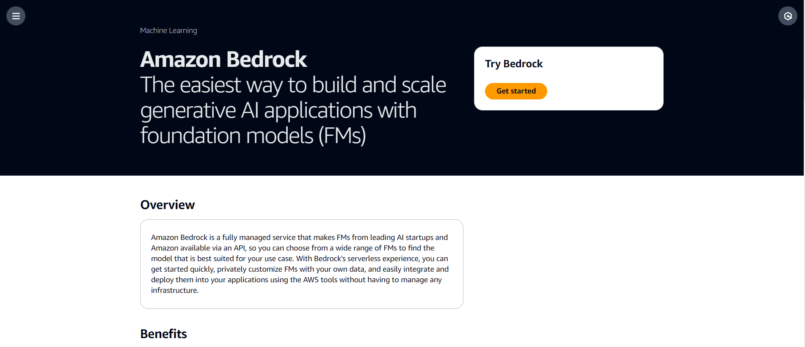
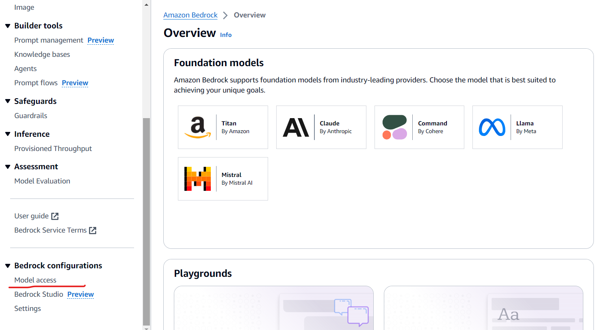

# **Execution Instructions**

1. Request Model Access on AWS Bedrock
2. Data Setup - Use the provided data to create s3 storage or directly use from local folder.
3. Environment Creation - Virtual environment Creation
4. AWS CLI - Credentials Setup
5. Streamlit Deployment on EC2 instance (Optional)


## 1. Request Model Access from AWS Bedrock

### Step 1: Log in to AWS
1. Go to the [AWS Management Console](https://aws.amazon.com/console).
2. Sign in with your AWS account credentials.

### Step 2: Navigate to Amazon Bedrock
1. In the AWS Management Console, use the search bar to find "Bedrock."
2. Select "Bedrock" from the search results.


### Step 3: Initiate Access Request
1. On the Amazon Bedrock service page, click "Get Started."
2. In the left window, click "Manage Model Access."


### Step 4: Select the Models
1. In the model access section, choose "Amazon" from the list of available models.
2. This will display all available models, including Titan Text Embeddings V2 and Claude Sonnet Multimodal. Please ensure that your region has both of these models example US-EAST-1. You might need to change region if you don't see them in the list of available models. 

### Step 5: Request Model Access
1. Select the required models and scroll to the bottom of the page and click "Request Model Access."
2. After submitting the request, you will be redirected to the Bedrock overview page, where you can see the status of your access request (pending or granted).


## 2. Data Setup on S3

### Creating an S3 Bucket

### Using AWS Management Console

1. **Sign in to the AWS Management Console:**
   - Visit the [AWS Management Console](https://aws.amazon.com/console) and log in to your account.

2. **Navigate to Amazon S3:**
   - In the AWS Management Console, use the search bar to find "S3" and select "S3" from the search results.

3. **Create a New Bucket:**
   - Click the "Create bucket" button.
   - Enter a unique name for your bucket.
   - Select the AWS Region where you want to create the bucket.
   - Configure any additional settings, such as bucket versioning and encryption, as needed.
   - Click the "Create bucket" button at the bottom of the page to finalize the creation.


### Uploading Data to an S3 Bucket
Once the bucket is created, the data can be uploaded using Add File / Add Folder options on the Console.

## 3. Virtual Environment Creation

### Python version 3.10.4

To create a virtual environment and install requirements in Python 3.10.4 on different operating systems, follow the instructions below:

### For Windows:

Open the Command Prompt by pressing Win + R, typing "cmd", and pressing Enter.

Change the directory to the desired location for your project:


`cd C:\path\to\project`

Create a new virtual environment using the venv module:


`python -m venv myenv`

Activate the virtual environment:
`myenv\Scripts\activate`


Install the project requirements using pip:
`pip install -r requirements.txt`

### For Linux/Mac:
Open a terminal.

Change the directory to the desired location for your project:

`cd /path/to/project`

Create a new virtual environment using the venv module:

`python3.10 -m venv myenv`


Activate the virtual environment:
`source myenv/bin/activate`

Install the project requirements using pip:
`pip install -r requirements.txt`

These instructions assume you have Python 3.10.4 installed and added to your system's PATH variable.

### Execution Instructions if Multiple Python Versions Installed

If you have multiple Python versions installed on your system, you can use the Python Launcher to create a virtual environment with Python 3.10.4. Specify the version using the -p or --python flag. Follow the instructions below:

For Windows:
Open the Command Prompt by pressing Win + R, typing "cmd", and pressing Enter.

Change the directory to the desired location for your project:

`cd C:\path\to\project`

Create a new virtual environment using the Python Launcher:

`py -3.10 -m venv myenv`

Note: Replace myenv with your desired virtual environment name.

Activate the virtual environment:


`myenv\Scripts\activate`


Install the project requirements using pip:

`pip install -r requirements.txt`


### For Linux/Mac:
Open a terminal.

Change the directory to the desired location for your project:

`cd /path/to/project`

Create a new virtual environment using the Python Launcher:


`python3.10 -m venv myenv`


Note: Replace myenv with your desired virtual environment name.

Activate the virtual environment:

`source myenv/bin/activate`


Install the project requirements using pip:

`pip install -r requirements.txt`


By specifying the version using py -3.10 or python3.10, you can ensure that the virtual environment is created using Python 3.10.4 specifically, even if you have other Python versions installed.


To run the streamlit app

`streamlit run llm_app.py`


## 4. AWS CLI - Credentials Setup

This guide provides step-by-step instructions on how to configure your AWS credentials using the AWS Command Line Interface (AWS CLI). 

### Prerequisites

- **AWS Account:** Ensure you have an active AWS account. You can create one at [AWS Sign-Up](https://aws.amazon.com/).
- **AWS CLI Installed:** You must have AWS CLI installed on your machine. Follow the [AWS CLI installation guide](https://docs.aws.amazon.com/cli/latest/userguide/getting-started-install.html) if it's not already installed.

### Steps to Configure AWS Credentials

### Step 1: Open the Terminal

- Open a terminal window on your computer. This could be Command Prompt, PowerShell, or Terminal, depending on your operating system.

### Step 2: Obtain Your AWS Access Keys
- Navigate to the AWS Management Console.
- Go to IAM (Identity and Access Management).
- Select Users from the sidebar and click on your username.
- Under the Security credentials tab, find Access keys and click Create access key.
- Download the key file or copy the Access Key ID and Secret Access Key. Keep these credentials secure.

### Step 3: Run the AWS Configure Command

- Enter the following command in the terminal:
  ```bash
  aws configure
  ```
  You will be prompted to enter four pieces of information:

AWS Access Key ID: Your unique access key for AWS services.
AWS Secret Access Key: Your secret key for authentication.
Default Region Name: The AWS region you want to use by default (e.g., us-west-2, us-east-1).


## 5. Streamlit Deployment on EC2 instance (Optional)


This guide provides step-by-step instructions for deploying a Streamlit application on an AWS EC2 instance. 

### Prerequisites

- AWS Account
- Basic knowledge of AWS EC2, SSH, and Streamlit


### Deployment Steps
Refer the following project - [Learn to Build an End-to-End Machine Learning Pipeline - Part 2](https://www.projectpro.io/project-use-case/build-and-deploy-an-end-to-end-machine-learning-pipeline-for-a-classification-model)
### 1. Launching EC2 Instance

- Launch an EC2 instance on AWS with the following specifications:
  - Ubuntu 22.04 LTS
  - Instance Type: t2.small (or your preferred type according to size)
  - Security Group: Allow inbound traffic on port 8501 for Streamlit

- Create and download a PEM key for SSH access to the EC2 instance.

- Disable Inheritance and Restrict Access on PEM key For Windows Users:
    - Locate the downloaded PEM key file (e.g., your-key.pem) using File Explorer.

    - Right-click on the PEM key file and select "Properties."

    - In the "Properties" window, go to the "Security" tab.

    - Click on the "Advanced" button.

    - In the "Advanced Security Settings" window, you'll see an "Inheritance" section. Click on the "Disable inheritance" button.

    - A dialog box will appear; choose the option "Remove all inherited permissions from this object" and click "Convert inherited permissions into explicit permissions on this object."

    - Once inheritance is disabled, you will see a list of users/groups with permissions. Remove permissions for all users except for the user account you are using (typically an administrator account).

    - Click "Apply" and then "OK" to save the changes.


### 2. Accessing EC2 Instance

1. Use the following SSH command to connect to your EC2 instance:
  ```
  ssh -i "your-key.pem" ubuntu@your-ec2-instance-public-ip
  ```

2. Gain superuser access by running: `sudo su`

3. Updating and Verifying Python
  - Update the EC2 instance with the latest packages:
    `apt update`

  - Verify Python installation:
    `python3 --version`

4. Installing Python Packages
`apt install python3-pip`

5. Transferring Files to EC2
    Use SCP to transfer your Streamlit application code to the EC2 instance:

    ```scp -i "your-key.pem" -r path/to/your/app ubuntu@your-ec2-instance-public-ip:/path/to/remote/location```

6. Setting Up Streamlit Application
    Change the working directory to the deployment files location:

    `cd /path/to/remote/location`

    Install dependencies from your requirements file:

    `pip3 install -r requirements.txt`

7. Running the Streamlit Application
    Test your Streamlit application (Use external link):
    `streamlit run app.py`


    For a permanent run, use nohup:
    `nohup streamlit run app.py`

8. Cleanup and Termination
To terminate the nohup process:
  - `sudo su`
  - `ps -df`
  - `kill {process id}`


```